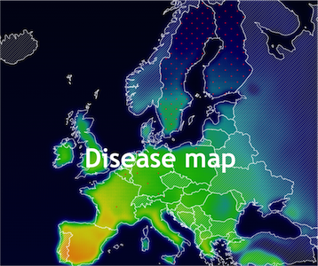

# Disease map

Incidence rate of vector-borne diseases in changing climates

# Background

---

Changing climates can influence the geographic distribution of insects that transmit diseases such as dengue (main vector: Aedes mosquitos), malaria (Anopheles mosquitos), or tick-borne encephalitis (TBE, Ixodes ticks). While ticks that transmit TBE are endemic in Eastern Europe, mosquitos of the genera Aedes (especially the vectors of the dengue virus Aedes aegypti and Aedes albopictus) and Anopheles have been observed occationally in some areas in Southern Europe where they are known as invasive species[1]. Whether the disease vectors can spread to new areas depends on multiple factors, including temperature, rainfall, and humidity. Studies showed for example that milder conditions enable ticks and mosquitos to overwinter [2, 3, 4]. For this reason, I focused on the distribution of the abovementioned diseases in Europe in connection with the average January temperature between 2008 and 2017, so as to see whether a trend is observable.

# Appoach

---

The disease data has been downloaded from the [European Centre for Disease Prevention and Control (ecdc)](https://atlas.ecdc.europa.eu/public/index.aspx). Not for all countries data was available at all times. The temperature data has been downloaded from the [Climate Data Store](https://cds.climate.copernicus.eu/cdsapp#!/home). The temperatures represent the average January temperature 2 m above ground. The simpleheat.js library was used to map the temperatures. For some areas (e.g. in Turkey or waters) no data was available. These areas appear black on the map. The textures.js library was used to create the patterns.

# Results and Conclusion

---

No clear trend between rising temperatures and rising disease incidence rates is observable. There are multiple possible explanations for this finding.

- It should be considered that the reported notification rates strongly depend on the quality of the public health surveillance. Not all disease incidences might be reported in every country at all times. This can make it difficult to compare incidence rates between countries and over time.
- It is important to notice that the majority of malaria and dengue cases in Europe are currently imported by international travelers and immigrants. Local transmission has only been observed occasionally in certain countries in southern Europe. Thus, it is not surprising that temperature and incidence rate do not seem to correlate.
- The map only shows the data of one decade (all that was available from the European Centre for Disease Prevention). It is possible that a trend could be detected when comparing data over a longer time frame.
- Multiple other factors apart from temperature, such as humidity or the availability of breeding sites, influence how well insects can spread. For simplicity reasons, they were not (yet) included in this model.

It will be of interest to analyze more data in the future. According to current projections the temperatures in Europe will continue to rise and certain mosquitos such as Aedes or Anopheles will become endemic and ticks more abundant. It is likely that there will be an increase in cases of diseases transmitted by these insects locally.

[1] [European Centre for Disease Prevention and Control (ecdc)](https://atlas.ecdc.europa.eu/public/index.aspx)

[2] [Caminade C., et al. 2012 Suitability of European climate for the Asian tiger mosquito Aedes albopictus: recent trends and future scenarios J R Soc Interface](https://doi.org/10.1098/rsif.2012.0138)

[3] [Lindgren E., Gustafson R., 2001 Tick-borne encephalitis in Sweden and climate change The Lancet](https://www.thelancet.com/journals/lancet/article/PIIS0140-6736(00)05250-8/fulltext)

[4] [Piperaki E., Daikos L., 2016 Malaria in Europe: emerging threat or minor nuisance? Clin Microbiol Infect](https://www.sciencedirect.com/science/article/pii/S1198743X16301203)